# TSPGAsolution

[中文]() | English

An implement of GA for TSP

This is my AI course work.

# Documentation

## Install

```shell
# Windows
git clone https://github.com/MinzhiYoyo/TSPGAsolution
cd TSPGAsolution
pip install -r requirements.txt

# Linux
git clone https://github.com/MinzhiYoyo/TSPGAsolution
cd TSPGAsolution
pip3 install -r requirements.txt
```

## Usage

```shell
# Windows
python GA.py  # test

# Linux
python3 GA.py  # test
```

And you need to change the code to fit your own needs. Usually you just change the `main.py` file.

# Algorithm Description

- generation number: 500
- population size: 100
- crossover rate: 0.8
- mutation rate: 0.3
- selection method: roulette wheel selection
- crossover method: click [here](#Corssover Method) 
- mutation method: randomly swap two points in the path

# Next Generation

## Original

Select -> Crossover -> Mutation

## Optimization

- Select the best 25% of the population, then not use the crossover and mutation method to generate the next generation.
- Select 25% of the population, then use the crossover and mutation method to generate the next generation.
- Select 25% of the population, then just use the crossover method to generate the next generation.
- Select 25% of the population, then just use the mutation method to generate the next generation.

# Crossover Method

## Choose One parent

First, randomly generate a point, then exchange the path before and after the point.

## Choose Two parents

*This is an optimization of crossover*

One is `father`, the other is `mother`.

Randomly generate a point `idx`. Find all value (`father[idx:]`) of `mother` and rearrange mother's order according to father's order.

Vice versa.

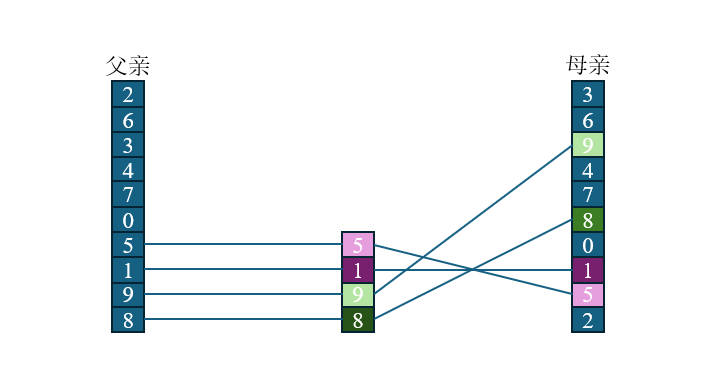

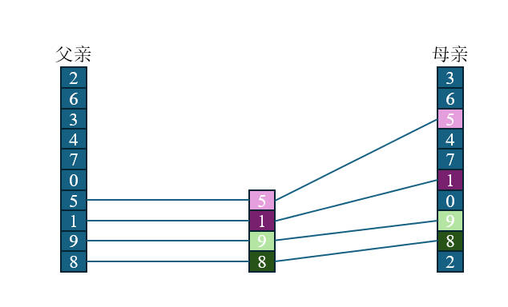

# Results

## Solution Results

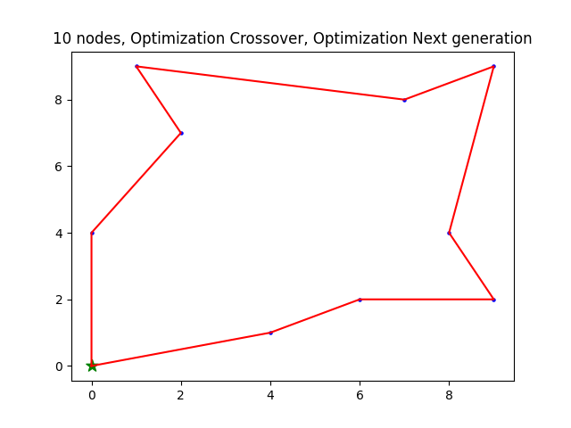
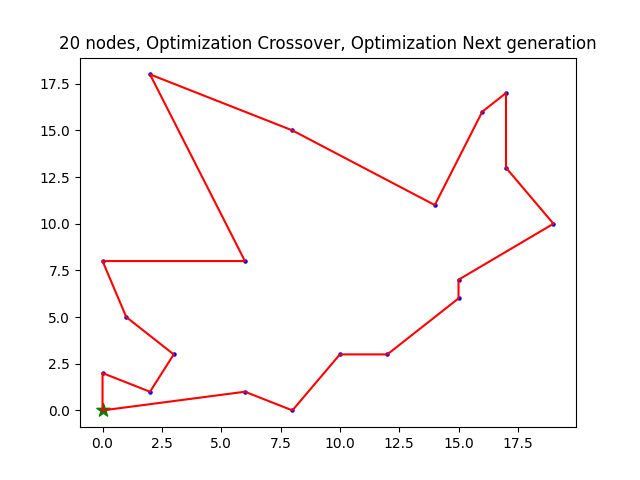
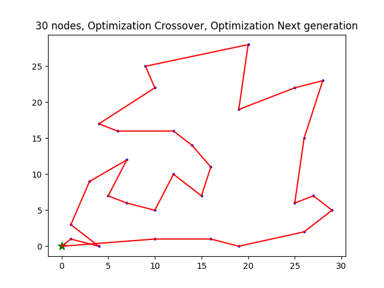
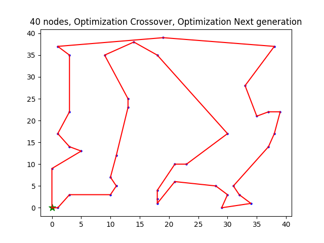
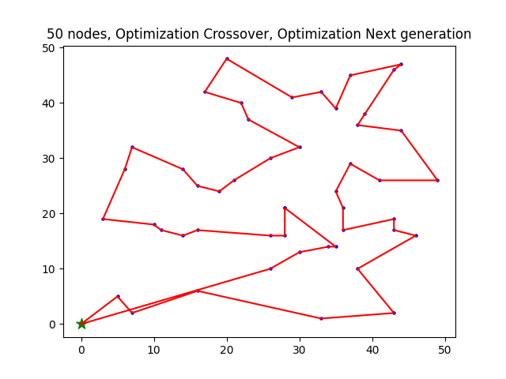

## Convergence

- Line1: Optimization Crossover, Optimization Next generation
- Line2: Optimization Crossover, No Optimization Next generation
- Line3: No Optimization Crossover, Optimization Next generation
- Line4: No Optimization Crossover, No Optimization Next generation

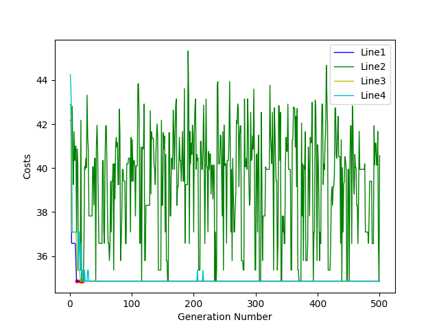
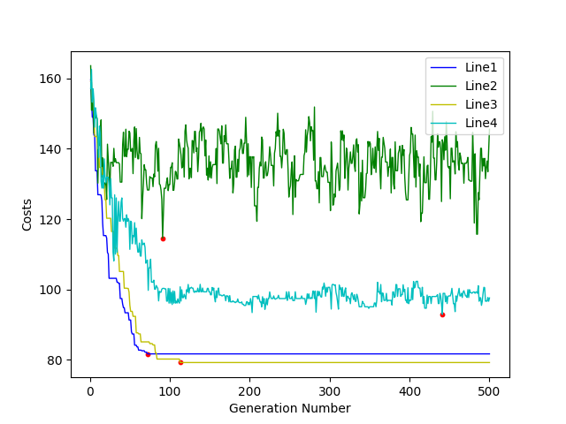
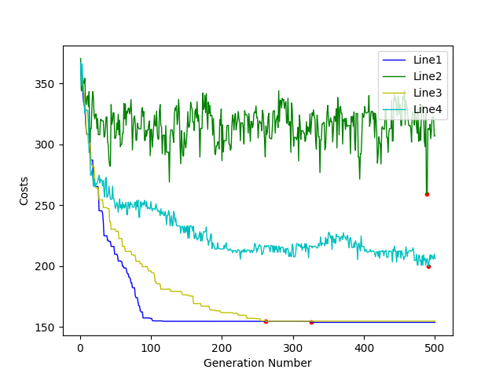
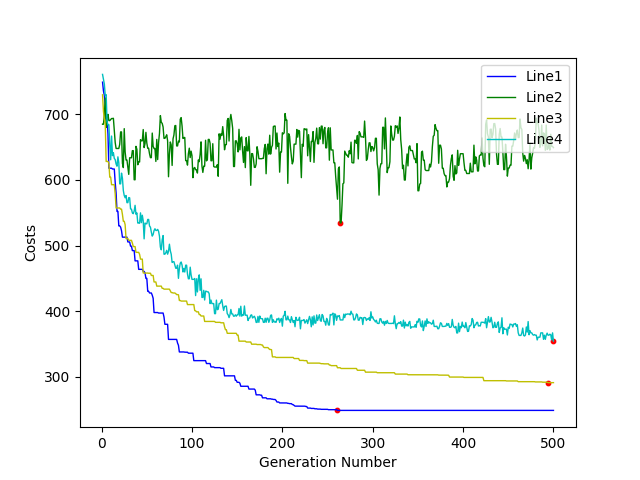
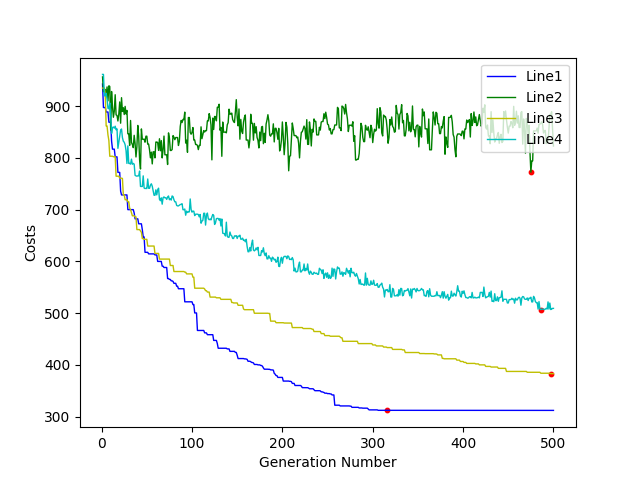
 
