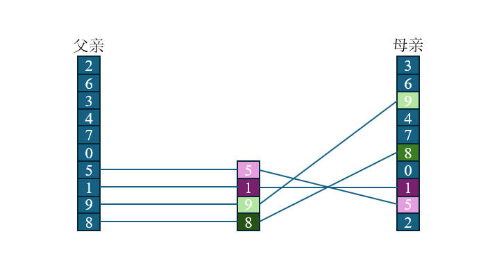
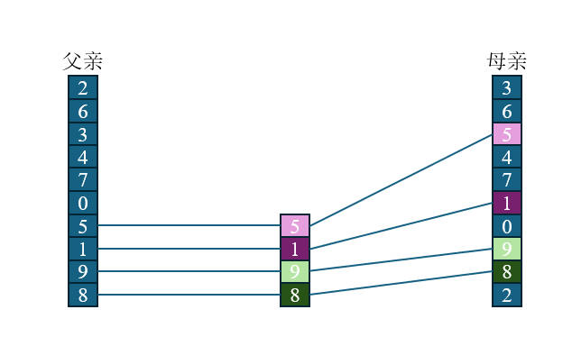
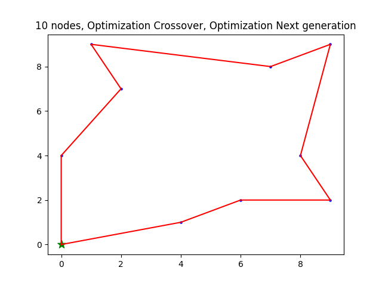
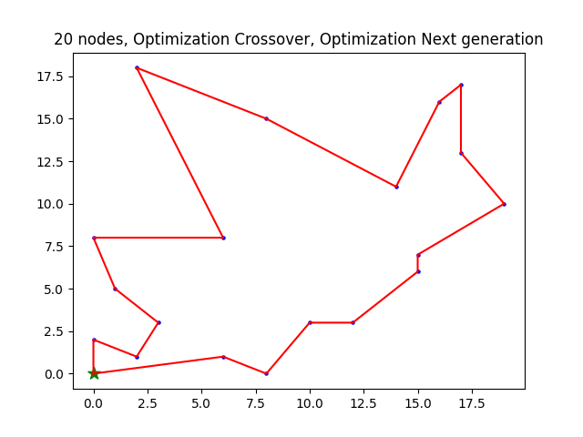
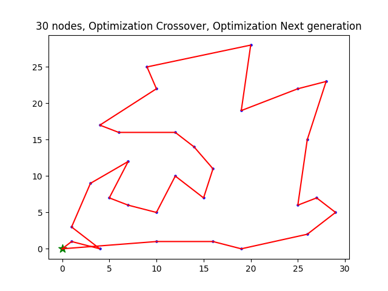
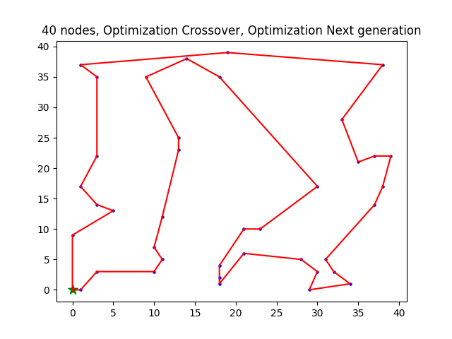
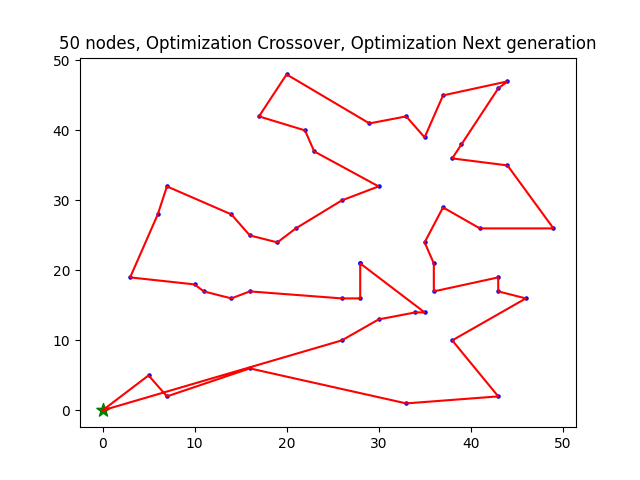
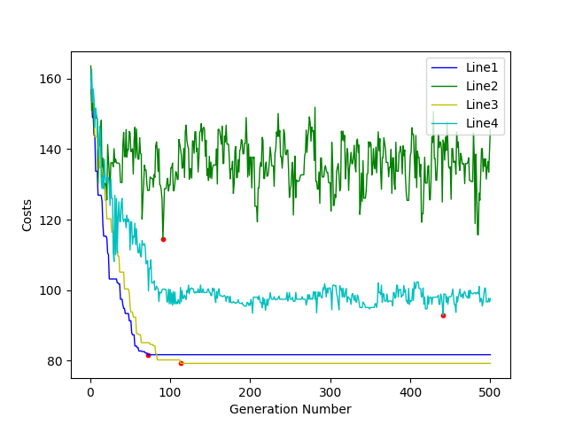
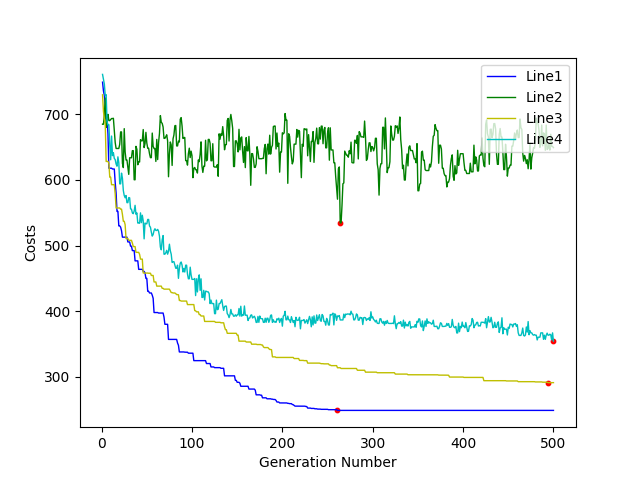
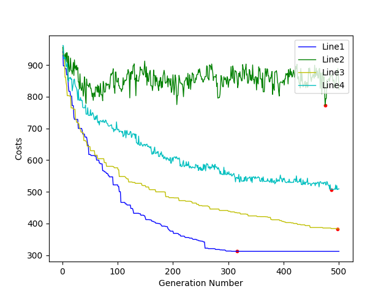

# TSPGAsolution

中文 | [English](https://github.com/MinzhiYoyo/TSPGAsolution?tab=readme-ov-file)

TSP的GA实现

这是我的AI课程作业。

# 文档

## 安装

```shell
# Windows
git clone https://github.com/MinzhiYoyo/TSPGAsolution
cd TSPGAsolution
pip install -r requirements.txt

# Linux
git clone https://github.com/MinzhiYoyo/TSPGAsolution
cd TSPGAsolution
pip3 install -r requirements.txt
```

## 用法

```shell
# Windows
python GA.py  # test

# Linux
python3 GA.py  # test
```

你需要改变代码来适应你自己的需求，一半只需要改变`main.py`文件即可。

# 算法描述

- 迭代数: 500
- 种群大小: 100
- 交叉率: 0.8
- 变异率: 0.3
- 选择方法: 轮盘赌
- 交叉方法: 点[这](#交叉方法) 
- 变异方法: 随机交换路径中的两个点

# 下一代生成

## 原始

选择 -> 交叉 -> 变异

## 优化

- 选择最好的25%的种群，然后不使用交叉和变异方法生成下一代。
- 选择25%的种群，然后使用交叉和变异方法生成下一代。
- 选择25%的种群，然后只使用交叉方法生成下一代。
- 选择25%的种群，然后只使用变异方法生成下一代。

# 交叉方法

## 只有一个父代

首先，随机生成一个点，然后交换点前后的路径。

## 有两个父代

*这是交叉方法的优化*

一个是`父亲`，另一个是`母亲`。首先随机生成一个点`idx`，找到`母亲`的所有值(`father[idx:]`)并根据`父亲`的顺序重新排列`母亲`的顺序。

反之亦然。





# 结果

## 求解结果







## 收敛

- Line1: 优化交叉，优化下一代生成
- Line2: 优化交叉，不优化下一代生成
- Line3: 不优化交叉，优化下一代生成
- Line4: 不优化交叉，不优化下一代生成






 
